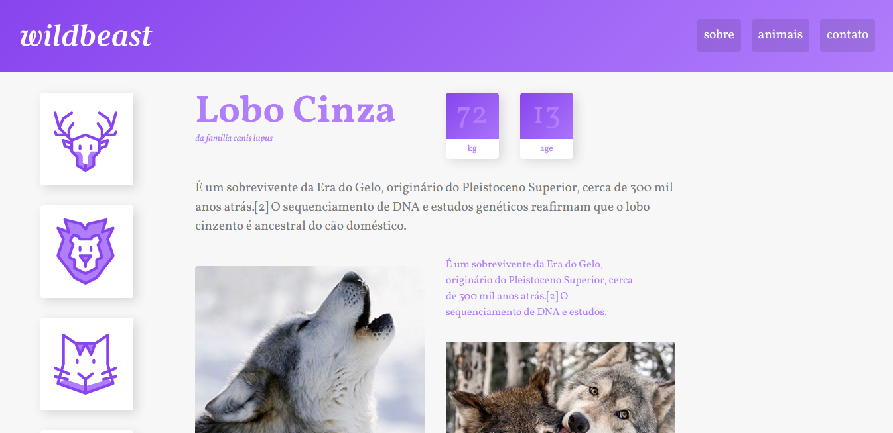

  
  <!-- PROJECT NAME
  --------------------------------------------------------------------->
  ## PROJETO WILDBEAST
  
   

  <!-- PROJECT IMAGE
  --------------------------------------------------------------------->  
  

  

<!-- PROJECT ABOUT
--------------------------------------------------------------------->
## 📝 Sobre
O design e o desenvolvimento do projeto Wildbeast foi criado durante o curso de CSS Grid Layout, nesse curso aprendi como utilizar da maneira correta a propriedade display com valor grid, para criar layouts de páginas responsívos.

<!-- PROJECT TECHS
--------------------------------------------------------------------->
  
## 💻 Linguagens Usadas

<!-- PROJECT CONTACT
--------------------------------------------------------------------->
  
## 😄 Contato
📫 Você pode me contatar em **allanld29@proton.me**

<!-- BACK
--------------------------------------------------------------------->
<h3 align="right"><a href="#top">⬆️</a></h3>
